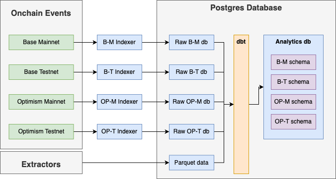

# Data Stack

A collection of services to index, store, and transform data related to Synthetix smart contracts. A summary of each service is provided below. If you would like more information about running each of these services, visit the README in the respective directory.

## Services



At a high level, the data stack contains a set of services to listen to onchain events, store that event data in a Postgres database, then transform and aggregate that data into a format that is useful for analytics.

Read more about each service:
* [**Database**](./postgres/) - A Postgres database used to store raw and transformed data.
* [**Indexers**](./indexers/) - Blockchain indexers using Subsquid archives to index Synthetix smart contracts. These indexers are used to populate a Postgres database with raw event log data.
* [**Extractors**](./extractors/) - Scripts that extract blockchain data using `eth_call` RPC calls and [cryo](https://github.com/paradigmxyz/cryo). Data is stored in the a `parquet-data` directory, and will be imported into the Postgres database using the Transformers service.
* [**Transformers**](./transformers/) - Services that transform raw event log data into a format that is more useful for querying. These services are used to populate a Postgres database with transformed data using [dbt](https://www.getdbt.com/).
* [**Dashboard**](./dashboard/) - A collection of dashboards built using [streamlit](https://streamlit.io/) and connected directly to the Postgres database.

## Usage

### Configuration

The services are all managed using [docker compose](https://docs.docker.com/compose/). Review the `docker-compose.yml` file to view the services that will run on startup. Some of these services require configuration through environment variables, which should be copied and populated in a `.env` file. In the root directory use these to configure your environment:

- `NETWORK_X_RPC`: The RPC endpoint for a specified network. Replace `X` with the network id (ex. 1 for Ethereum mainnet, 10 for Optimism mainnet).
- `PG_PASSWORD`: The password for the admin user of the Postgres database.
- `READONLY_PASSWORD`: The password for a configured read-only user, used for dashboards. Change this password and run `make reset-pw` to update the user's password.
- `DB_PORT`: The port that will be used to expose the Postgres database. If left blank, the database will only be exposed to the docker network.
- `DASHBOARD_PORT`: The port used to expose the streamlit dashboards.
- `LEGACY_DB_LOCATION`: The location of a legacy SQLite database. This database is used in Optimism Mainnet dashboards summarizing activity on the legacy perps V2 contracts.

### Start Indexers

Once you have configured your environment, run `docker compose up -d --build` to build and run the services in detached mode. By default, the service will start a Postgres database, indexers for each network, and a streamlit dashboard on startup. Each indexer will write data to a database corresponding with the network name (ex. `base_mainnet`). You can view the logs for each service using `docker compose logs -f <service-name>`.

The dashboard service relies on transformed data in the `analytics` database. To populate this database, you must run the transformers.

### Run Extractors

To populate the `parquet-data` directory with data, you must run the extractors. These scripts will run the `eth_call` RPC method for each of the specified calls in the `extractors/main.py` file. To run the extractors, use the following command:

```bash
make extract
```

You can view the data in the `parquet-data` directory, which should contain both `raw` and `clean` directories populated with data for each network.

### Running Transformers

To simplify queries and transformed data, you must run the transformers to populate the `analytics` database. This happens in two steps, first by wrapping the raw tables as foreigns tables in the `analytics` database, then running dbt for each of the relevant schemas. To do this, run:

```bash
make build  # build the docker image for the transformers
make wrap   # wrap the raw tables as foreign tables in the analytics database
make import # import the data from the parquet files into the database
make dbt    # run dbt for each network
```

You should see output confirming that dbt has run for each network, and created a set of tables and views in the `analytics` database. The running dashboard service will automatically detect these tables and views and populate the dashboards with data. To view the dashboards, visit `http://localhost:<DASHBOARD_PORT>` in your browser.
