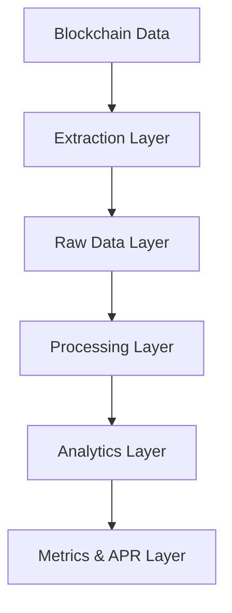
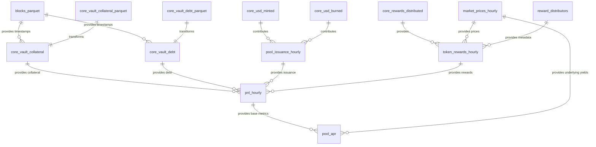

# Synthetix Data Modeling Architecture Documentation

## 1. Data Models & Relationships

### 1.1 Data Flow Architecture



### 1.2 Raw Data Models

#### Blockchain Data Tables
| Table Name | Description | Key Fields | Upstream | Downstream |
|------------|-------------|------------|----------|------------|
| `blocks_parquet` | Block timestamps and numbers | `timestamp`, `block_number` | Blockchain RPC | All event tables |
| `core_vault_collateral_parquet` | Raw vault collateral data | `block_number`, `contract_address`, `pool_id`, `collateral_type`, `amount`, `collateral_value` | Blockchain RPC | `core_vault_collateral` |
| `core_vault_debt_parquet` | Raw vault debt data | `block_number`, `contract_address`, `pool_id`, `collateral_type`, `debt` | Blockchain RPC | `core_vault_debt` |

#### Event Tables
| Table Name | Description | Key Fields | Upstream | Downstream |
|------------|-------------|------------|----------|------------|
| `core_rewards_claimed` | Reward claim events | `block_timestamp`, `account_id`, `pool_id`, `collateral_type`, `distributor`, `amount` | Blockchain Events | `rewards_claimed` |
| `core_rewards_distributed` | Reward distribution events | `block_timestamp`, `pool_id`, `collateral_type`, `distributor`, `amount`, `start`, `duration` | Blockchain Events | `token_rewards_hourly` |
| `core_usd_minted` | USD minting events | `block_timestamp`, `pool_id`, `account_id`, `collateral_type`, `amount` | Blockchain Events | `pool_issuance_hourly` |
| `core_usd_burned` | USD burning events | `block_timestamp`, `pool_id`, `account_id`, `collateral_type`, `amount` | Blockchain Events | `pool_issuance_hourly` |
| `perp_market_created` | Market creation events | `block_timestamp`, `perps_market_id`, `market_name`, `market_symbol` | Blockchain Events | `market_prices_hourly` |
| `perp_market_updated` | Market update events | `block_timestamp`, `market_id`, `price`, `skew`, `size` | Blockchain Events | `market_prices_hourly` |
| `buyback_processed` | SNX buyback events | `block_timestamp`, `buyer`, `snx`, `usd` | Blockchain Events | `market_prices_hourly` |
| `core_account_migrated` | Account migration events (ETH only) | `block_timestamp`, `staker`, `account_id`, `collateral_amount`, `debt_amount` | Blockchain Events | `core_migration_hourly` |

#### Reference Tables
| Table Name | Description | Key Fields | Upstream | Downstream |
|------------|-------------|------------|----------|------------|
| `tokens` | Token reference data | `token_address`, `token_symbol`, `yield_token_symbol` | CSV Seeds | Multiple |
| `reward_distributors` | Reward distributor data | `distributor_address`, `token_symbol`, `reward_type` | CSV Seeds | `token_rewards_hourly` |

### 1.3 Processing Layer

| Table Name | Description | Key Fields | Upstream | Downstream |
|------------|-------------|------------|----------|------------|
| `core_vault_collateral` | Processed collateral data | `ts`, `block_number`, `pool_id`, `collateral_type`, `amount`, `collateral_value` | `core_vault_collateral_parquet`, `blocks_parquet` | `pnl_hourly` |
| `core_vault_debt` | Processed debt data | `ts`, `block_number`, `pool_id`, `collateral_type`, `debt` | `core_vault_debt_parquet`, `blocks_parquet` | `pnl_hourly`, `pool_issuance_hourly` |
| `pool_issuance` | Combined minting/burning view | `ts`, `pool_id`, `collateral_type`, `amount` | `core_usd_minted`, `core_usd_burned` | Analytics |

### 1.4 Analytics Layer

| Table Name | Description | Key Fields | Upstream | Downstream |
|------------|-------------|------------|----------|------------|
| `market_prices_hourly` | Hourly prices for all assets | `ts`, `market_symbol`, `prices` | `perp_market_updated`, `core_vault_collateral`, `tokens` | Multiple |
| `pool_issuance_hourly` | Hourly issuance metrics | `ts`, `pool_id`, `collateral_type`, `hourly_issuance` | `core_usd_minted`, `core_usd_burned` | `pnl_hourly` |
| `token_rewards_hourly` | Hourly reward distributions | `ts`, `pool_id`, `collateral_type`, `distributor`, `token_symbol`, `amount`, `rewards_usd` | `core_rewards_distributed`, `reward_distributors`, `market_prices_hourly` | `pnl_hourly` |
| `rewards_claimed` | Processed reward claims | `ts`, `pool_id`, `collateral_type`, `account_id`, `reward_type`, `token_symbol`, `amount`, `amount_usd` | `core_rewards_claimed`, `reward_distributors`, `market_prices_hourly` | Analytics |
| `core_migration_hourly` | Hourly debt migration (ETH) | `ts`, `pool_id`, `collateral_type`, `hourly_debt_migrated` | `core_account_migrated` | `pnl_hourly` |

### 1.5 Metrics Layer

| Table Name | Description | Key Fields | Upstream | Downstream |
|------------|-------------|------------|----------|------------|
| `pnl_hourly` | Hourly PnL calculations | `ts`, `pool_id`, `collateral_type`, `collateral_value`, `debt`, `hourly_issuance`, `hourly_pnl`, `rewards_usd`, `hourly_pnl_pct`, `hourly_total_pct` | `core_vault_collateral`, `core_vault_debt`, `pool_issuance_hourly`, `token_rewards_hourly` | `pool_apr` |
| `pool_apr` | Comprehensive APR metrics | `ts`, `pool_id`, `collateral_type`, `apr_24h`, `apy_24h`, `apr_7d`, `apy_7d`, `apr_28d`, `apy_28d`, `apr_24h_pnl`, `apr_24h_rewards`, etc. | `pnl_hourly`, `market_prices_hourly` | Dashboard/Frontend |

### 1.6 ERD for Key Relationships



## 2. Setting Up Mage.ai Locally

### 2.1 Environment Configuration

Create a `.env` file in your project root with the following variables (replace values with your own):

```
# Database Credentials
PG_HOST=your-postgres-host
PG_USER=your-postgres-user
PG_PASS=your-postgres-password
PG_PORT=your-postgres-port

# ClickHouse Credentials
CLICKHOUSE_HOST=your-clickhouse-host
CLICKHOUSE_PASS=your-clickhouse-password

# Network RPC Endpoints
NETWORK_1_RPC=your-ethereum-mainnet-rpc
NETWORK_42161_RPC=your-arbitrum-mainnet-rpc
NETWORK_8453_RPC=your-base-mainnet-rpc
NETWORK_10_RPC=your-optimism-mainnet-rpc

# Optional Test Networks
NETWORK_421614_RPC=your-arbitrum-testnet-rpc
NETWORK_84532_RPC=your-base-testnet-rpc

# Project Configuration
WORKING_DIR=/path/to/your/working/directory
DEBUG=0

# Optional Monitoring
DISCORD_WEBHOOK_URL=your-discord-webhook
AIRFLOW_BASE_URL=your-airflow-url
REPO_URL=https://github.com/your-repo-url
```

### 2.2 Project Setup with start.sh Script

There is `start.sh` file in root directory of transformer-mage directory can you run it to start mage locally. 

Before running start.sh , careate .env.tmp file and populate with above mentioned env variables. 


### 2.3 Running the Project

1. Execute the startup script:
   ```bash
   ./start.sh
   ```

2. Access the Mage.ai UI at `http://localhost:6789`

3. Import the pipeline configurations:
   - Navigate to Pipelines > New > Import from file
   - Select the YAML files from your repository

4. Configure ClickHouse connection:
   - Create `io_config.yaml` in your Mage project directory
   - Add ClickHouse connection details

### 2.4 Data Initialization

To initialize seed data:

1. Create directory structure:
   ```bash
   mkdir -p ${WORKING_DIR}/seeds/tokens
   mkdir -p ${WORKING_DIR}/seeds/reward_distributors
   mkdir -p ${WORKING_DIR}/seeds/synths
   ```

2. Import initial token data:
   ```bash
   # Example token data CSV format
   echo "token_address,token_symbol,yield_token_symbol" > ${WORKING_DIR}/seeds/tokens/arbitrum_mainnet_tokens.csv
   echo "0x...,WETH,stETH" >> ${WORKING_DIR}/seeds/tokens/arbitrum_mainnet_tokens.csv
   ```

3. Run the extractors pipeline first to create necessary tables

## 3. Data Transformation Details

### 3.1 Time Series Forward-Fill Pattern

Used throughout the codebase to ensure continuous time series data:

```sql
SELECT
    dim.ts as ts,
    dim.pool_id as pool_id,
    dim.collateral_type as collateral_type,
    coalesce(
        last_value(metric) OVER (
            PARTITION BY dim.collateral_type, dim.pool_id
            ORDER BY dim.ts
            ROWS BETWEEN UNBOUNDED PRECEDING AND CURRENT ROW
        ),
        0
    ) AS metric
FROM dim
LEFT JOIN source_table
    ON dim.ts = source_table.ts
    AND dim.pool_id = source_table.pool_id
    AND dim.collateral_type = source_table.collateral_type
```

### 3.2 Reward Distribution Model

Two types of rewards are handled:

1. **Instant Rewards**:
   ```sql
   SELECT
       date_trunc('hour', ts) as ts,
       pool_id,
       collateral_type,
       distributor,
       token_symbol,
       amount
   FROM token_rewards_distributed
   WHERE duration = 0
   ```

2. **Streaming Rewards**:
   ```sql
   SELECT
       d.ts as ts,
       d.pool_id as pool_id,
       d.collateral_type as collateral_type,
       d.distributor as distributor,
       d.token_symbol as token_symbol,
       (
           least(
               toFloat64(d.duration) / 3600.0,
               least(
                   (toUnixTimestamp(addHours(d.ts, 1)) - toUnixTimestamp(greatest(d.ts, d.ts_start))) / 3600.0,
                   (toUnixTimestamp(least(addSeconds(d.ts_start, d.duration), addHours(d.ts, 1))) - toUnixTimestamp(d.ts)) / 3600.0
               )
           )
       ) * d.amount / (toFloat64(d.duration) / 3600.0) AS amount
   FROM hourly_distributions AS d
   ```

### 3.3 APR/APY Calculation Logic

The APR/APY calculations follow standardized financial formulas:

```sql
-- Simple APR: Annualized average hourly return
avg_24h_total_pct * 24 * 365 AS apr_24h

-- Compounded APY: Account for compounding effect
pow(1 + (avg_24h_total_pct * 24 * 365 / 8760), 8760) - 1 AS apy_24h
```

Different APR/APY metrics are calculated:
- Total APR/APY (Combined performance)
- PnL APR/APY (From price movements)
- Rewards APR/APY (From incentives)
- Underlying APR/APY (From yield-bearing assets)

### 3.4 PnL Calculation

The profit and loss calculation follows this pattern:

```sql
-- Basic PnL: Previous debt - current debt = profit
coalesce(lagInFrame(debt) over (
    partition by pool_id, collateral_type
    order by ts
) - debt, 0) as hourly_pnl

-- PnL percentage: PnL relative to collateral value
CASE
    WHEN collateral_value = 0 THEN 0
    ELSE hourly_pnl / collateral_value
END AS hourly_pnl_pct
```

## 4. Network-Specific Handling

### 4.1 Conditional Logic Pattern

Throughout the codebase, network-specific behavior is handled with conditional checks:

```python
if kwargs['raw_db'] in ['eth_mainnet']:
    # ETH-specific logic
    return {}
    
if kwargs['raw_db'] in ['base_mainnet']:
    # Base-specific logic (e.g., buyback processing)
    # ...
```

### 4.2 Network-Specific Tables

Some tables are network-specific:

- **ETH Mainnet**:
  - `core_account_migrated`: Tracks migrations from legacy Synthetix
  - `core_migration_hourly`: Hourly aggregation of migrations

- **Base Mainnet**:
  - `buyback_processed`: SNX buyback events
  - Additional leveraged token logic

## 5. Advanced ClickHouse Optimizations

### 5.1 Table Engine Selection

```sql
ENGINE = ReplacingMergeTree()
ORDER BY (pool_id, collateral_type, ts)
PARTITION BY toYYYYMM(ts)
```

- **ReplacingMergeTree**: Handles duplicate elimination/updates
- **ORDER BY**: Optimizes for common query patterns (pool, collateral, time)
- **PARTITION BY**: Monthly partitioning for efficient data management

### 5.2 Materialized Views for PnL Hourly

Using ClickHouse materialized views for efficient continuous PnL computation:

```sql
CREATE MATERIALIZED VIEW pnl_hourly_mv
TO pnl_hourly AS
SELECT
    ts,
    pool_id,
    collateral_type,
    collateral_value,
    debt,
    hourly_issuance,
    hourly_pnl,
    rewards_usd,
    hourly_pnl_pct,
    hourly_rewards_pct,
    hourly_total_pct
FROM (
    -- Complex PnL calculation query
)
```

This approach reduces query complexity and improves performance for dashboard consumers.

This detailed documentation should provide a comprehensive understanding of your Synthetix data modeling approach, the relationships between tables, and how to set up the environment locally.